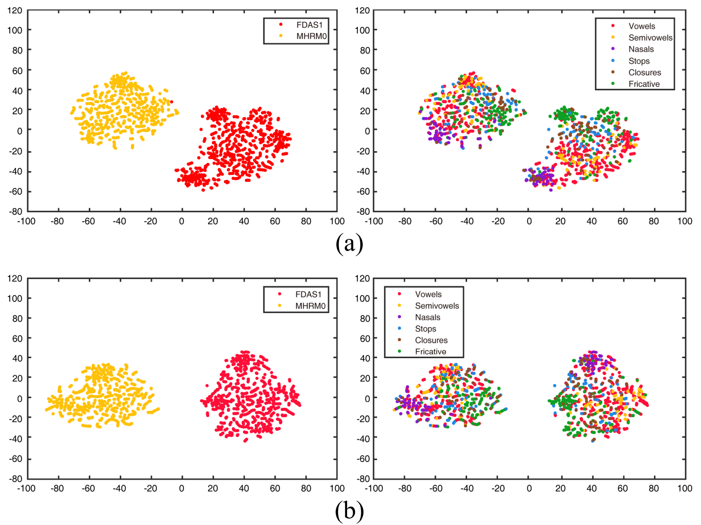

# TDY-CNN for Text-Independent Speaker Verification

Official implementation of <br>
 - **Temporal Dynamic Convolutional Neural Network for Text-Independent Speaker Verification and Phonemetic Analysis** <br>
by Seong-Hu Kim, Hyeonuk Nam, Yong-Hwa Park @ Human Lab, Mechanical Engineering Department, KAIST<br>
[](https://arxiv.org/abs/2110.03213) <br>

Accepted paper in [ICASSP 2022](https://2022.ieeeicassp.org/).

This code was written mainly with reference to [VoxCeleb_trainer](https://github.com/clovaai/voxceleb_trainer) of paper '[_In defence of metric learning for speaker recognition_](https://arxiv.org/abs/2003.11982)'.

## Temporal Dynamic Convolutional Neural Network (TDY-CNN)
TDY-CNN efficiently applies adaptive convolution depending on time bins by changing the computation order as follows: 


where x and y are input and output of TDY-CNN module which depends on frequency feature f and time feature t in time-frequency domain data. 
k-th basis kernel is convoluted with input and k-th bias is added. The results are aggregated using the attention weights which depends on time bins. 
K is the number of basis kernels, and σ is an activation function ReLU. 
The attention weight has a value between 0 and 1, and the sum of all basis kernels on a single time bin is 1 as the weights are processed by softmax. 

## Requirements and versions used
Python version of 3.7.10 is used with following libraries
- pytorch == 1.8.1
- pytorchaudio == 0.8.1
- numpy == 1.19.2
- scipy == 1.5.3
- scikit-learn == 0.23.2

## Dataset
We used VoxCeleb1 & 2 dataset in this paper. You can download the dataset by reffering to [VoxCeleb1](https://www.robots.ox.ac.uk/~vgg/data/voxceleb/vox1.html) and [VoxCeleb1](https://www.robots.ox.ac.uk/~vgg/data/voxceleb/vox2.html).

## Training
You can train and save model in `exps` folder by running:
```shell
python trainSpeakerNet.py --model TDy_ResNet34_half --log_input True --encoder_type AVG --trainfunc softmaxproto --save_path exps/TDY_CNN_ResNet34 --nPerSpeaker 2 --batch_size 400
```

This implementation also provides accelerating training with distributed training and mixed precision training.
- Use `--distributed` flag to enable distributed training and `--mixedprec` flag to enable mixed precision training.
  - GPU indices should be set before training : `os.environ['CUDA_VISIBLE_DEVICES'] ='0,1,2,3'` in `trainSpeakernet.py`.

### Results:

Network              | #Parm |  EER (%) | C_det (%) |
---------------------|:-----:|:--------:|:---------:|
TDY-VGG-M            | 71.2M |   3.04   |   0.237   |
TDY-ResNet-34(×0.25) | 13.3M | 1.58 |   0.116   |
TDY-ResNet-34(×0.5)  | 51.9M | 1.48 |   0.118   |



- This result is low-dimensional t-SNE projection of frame-level speaker embed-dings of MHRM0 and FDAS1 using (a) baseline model ResNet-34(×0.25) and (b) TDY-ResNet-34(×0.25). Left column represents embeddings for different speakers, and right column represents em-beddings for different phoneme classes.

- Embeddings by TDY-ResNet-34(×0.25) are closely gathered regardless of phoneme groups. It shows that the temporal dynamic model extracts consistent speaker information regardless of phonemes.


## Pretrained models
There are pretrained models in folder `pretrained_model`.

For example, you can check **1.4786 of EER** by running following script using TDY-ResNet-34(×0.5).
```shell
python trainSpeakerNet.py --eval --model TDy_ResNet34_half --log_input True --encoder_type AVG --trainfunc softmaxproto --save_path exps/test --eval_frames 400 --initial_model pretrained_model/pretrained_TDy_ResNet34_half.model
```

## Citation
```bib
@article{kim2021tdycnn,
  title={Temporal Dynamic Convolutional Neural Network for Text-Independent Speaker Verification and Phonemetic Analysis},
  author={Kim, Seong-Hu and Nam, Hyeonuk and Park, Yong-Hwa},
  journal={arXiv preprint arXiv:2110.03213},
  year={2021}
}
```

Please contact Seong-Hu Kim at seonghu.kim@kaist.ac.kr for any query.

